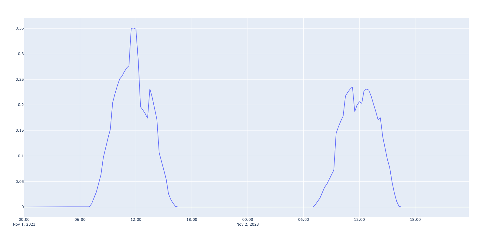

# Open Source PV Forecast

The aim of the project is to build an forecast that is free and easy to use.

The current model uses GFS NWPs to predict the solar genertion at a site


```python
from datetime import datetime

from ocf_os_pv_forecast.forecast import run_forecast
from ocf_os_pv_forecast.pydantic_models import PVSite

# make input data
site = PVSite(latitude=51.75, longitude=-1.25, capacity_kwp=1.25)
ts = datetime(2023, 11, 1, 0, 0, 0)

# run model
predications_df = run_forecast(site=site, ts=ts)
```

Which gives the following prediction



## Model

The model is a gradient boosted tree model and uses 9 NWP variables.
It is trained on 25,000 PV sites with over 5 years of PV history, which is available [here](https://huggingface.co/datasets/openclimatefix/uk_pv).
The training of this model is handled in [pv-site-prediction](https://github.com/openclimatefix/pv-site-prediction)
TODO - we need to benchmark this forecast. 

## Known restrictions

- The model is trained on [UK MetOffice](https://www.metoffice.gov.uk/services/data/met-office-weather-datahub) NWPs, but when running inference we use [GFS](https://www.ncei.noaa.gov/products/weather-climate-models/global-forecast) data from [Open-meteo](https://open-meteo.com/). The differences between GFS and UK MetOffice, could led to some odd behaviours.
- It looks like the GFS data on Open-Meteo is only available for free for the last 3 months. 

## Abbreviations

- NWP
- GFS
- PV
- 

## Contribution

We welcome other models